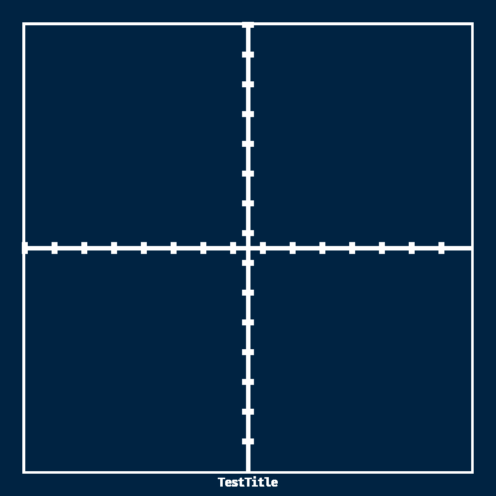

# :hammer: Graphing Utility
This program is a graphing utility where the user specifies a file text file
with points and or a set of transcendental functions and this program will take
that specification and turn it into a `.png` file representative of this
points/functions.

# :star: Current Progress
Currently, the graph presets are working and this graph outline was generated
using the program in its current form:

